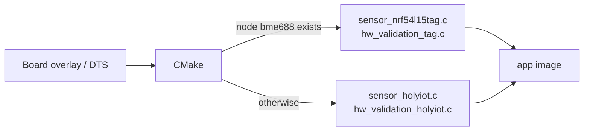
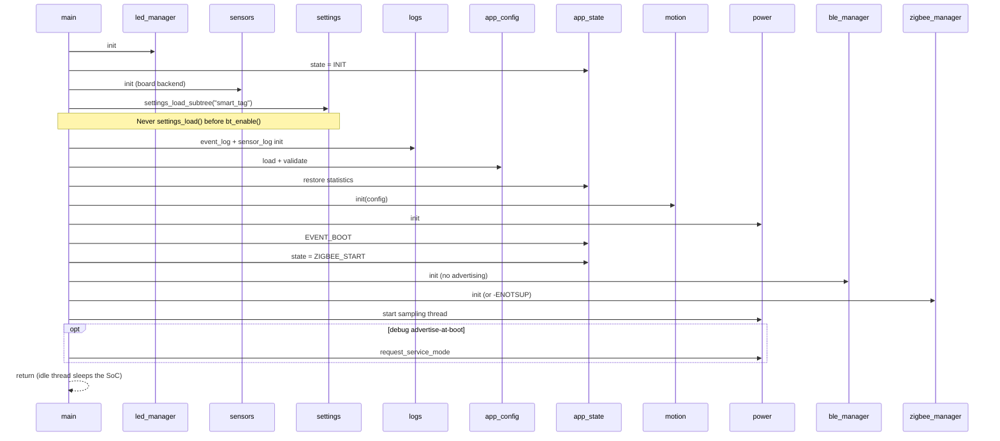
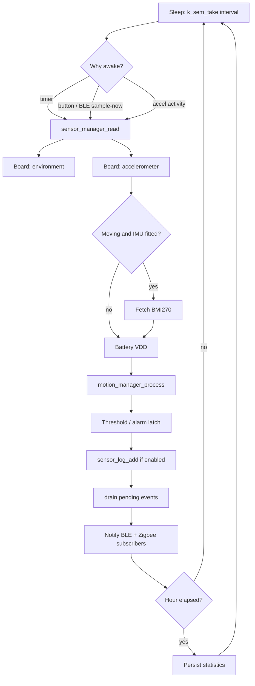
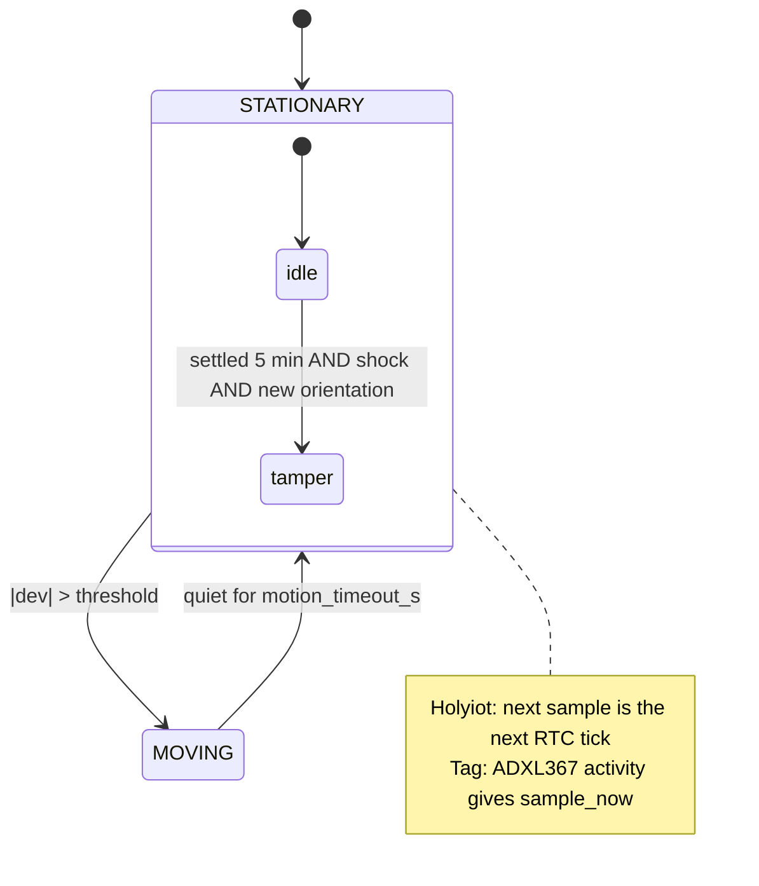
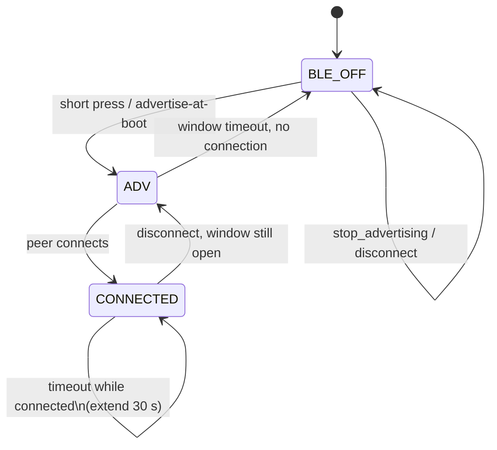
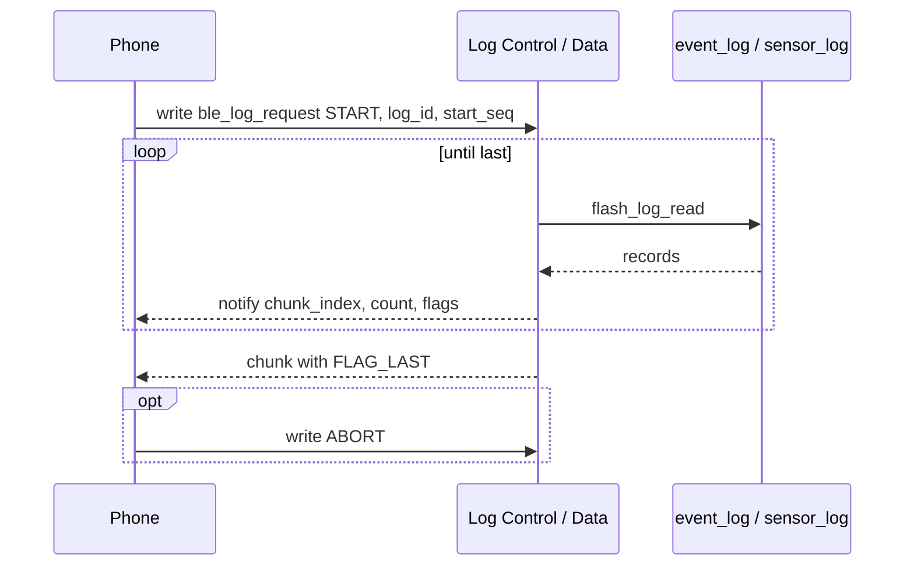
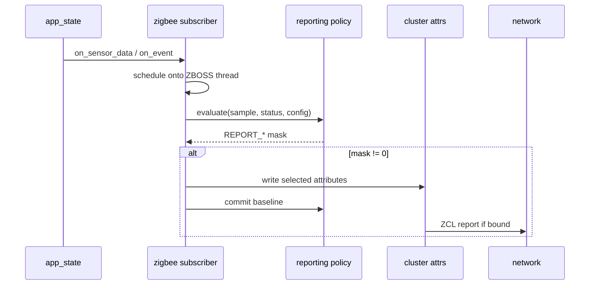

# nRF54L15 Smart Tag — system design

**Status:** design of record for firmware V1 (protocol v3), dual-hardware.
**Supersedes:** [PLAN.md](PLAN.md) (original sketch).
**Review of the original:** [DESIGN_REVIEW.md](DESIGN_REVIEW.md).
**Bring-up procedure:** [HARDWARE_VALIDATION.md](HARDWARE_VALIDATION.md).

This document is the redefined system design. It describes the product as
it should be maintained: two boards, one application, Zigbee for the hub,
BLE for the phone, and a host-tested policy core.

---

## 1. Purpose and scope

The Smart Tag is a coin-cell asset / environment / shipping monitor on
Nordic nRF54L15. It measures climate and motion, stores a local history,
raises alarms, and reports:

- **Zigbee** (sleepy end device) — remote telemetry to a hub.
- **BLE** (peripheral, on demand) — commissioning, configuration, log
  download, diagnostics.

Out of scope for V1: a mobile app (the GATT contract is specified so one
can be built), cloud, mesh routing, and calibrated VOC in ppm.

---

## 2. Product identity

One product family, one protocol, several roles. The role is a runtime
`tag_mode_t`, not a different firmware image.

```
              SMART TAG
                  │
     ┌────────────┼────────────┐
     │            │            │
 Environment    Asset      Shipping
  (climate)   (presence)   (shock)
     │            │            │
     └────────────┼────────────┘
                  │
        Same application image
        Board-specific sensors
```

| Mode | Sampling emphasis | Typical use |
|---|---|---|
| Environment (0) | Configured interval | Room / warehouse climate |
| Asset (1) | 2× faster while relevant | Presence, tamper |
| Shipping (2) | 4× faster while moving | Shock, free fall |

On a board with an accelerometer wake source, the mode divider applies
**while moving**. While stationary the tag sleeps at the configured
interval and the interrupt provides motion latency. On a board without a
wake source, the divider *is* the latency (see §8.3).

---

## 3. Hardware

### 3.1 Supported targets

| Id | Board | Sensors | Log storage | Motion wake |
|---|---|---|---|---|
| HW-HOLYIOT | `holyiot_25025/nrf54l15/cpuapp` | SHT40, LPS22HB, LIS2DH12 | BY25Q16 SPI NOR 2 MB | No (INT on P2) |
| HW-TAG | `nrf54l15tag/nrf54l15/cpuapp` | BME688, ADXL367, BMI270 | Internal RRAM | Yes (ADXL367 INT1 / P0.03) |
| HW-DK | `nrf54l15dk/nrf54l15/cpuapp` | None fitted (Holyiot pin overlay) | Overlay NOR node | No |

The DK target exists to compile and exercise BLE + structure. It is not a
product.

### 3.2 Capability model

The application never names a part outside `src/sensors/`. Everything
above the sensor layer consumes **capabilities**:

| Capability | Holyiot | Tag | Meaning |
|---|---|---|---|
| `temp_rh` | SHT40 | BME688 | Temperature + humidity |
| `pressure` | LPS22HB | BME688 | Atmospheric pressure |
| `gas` | — | BME688 | VOC resistance (ohms) |
| `accel` | LIS2DH12 | ADXL367 | Always-on accelerometer |
| `gyro` | — | BMI270 | Read only while moving |
| `wake_source` | — | ADXL367 | Can preempt the sample timer |
| `ext_flash` | BY25Q16 | — | JEDEC identity; logs otherwise in RRAM |
| `button` | P1.13 | P0.00 | Opens BLE window / factory reset |
| `rgb_led` | Common-anode RGB | LED1 only | Priority indications |

A sample is faulty when it is missing any bit in
`sensor_manager_expected_valid()` — the mask of capabilities that actually
came up at init — not a hard-coded constant. Gyroscope is excluded from
that mask because a stationary sample legitimately has it clear.

### 3.3 Hardware constraints that shape the design

1. **P2 has no GPIOTE / SENSE on nRF54L15.** Holyiot LIS2DH12 INT1/INT2
   cannot interrupt or wake. Motion is polled. A PCB respin that routes
   INT to P0/P1 is a hardware project, not a firmware one.
2. **nRF54L SPIM frequency is exact.** `spi-max-frequency` must divide the
   instance base clock into an even prescaler. 8 MHz is the value that
   works on SPIM00 (128 MHz) and SPIM21 (16 MHz); they are not
   interchangeable.
3. **No UART on the product.** Console is RTT.
4. **No battery divider.** CR2032 is VDD. SAADC internal `NRF_SAADC_VDD`
   (not AVDD).
5. **Coin cell.** LEDs blink, BLE is off until asked, Zigbee is sleepy,
   BMI270 is off while still.

---

## 4. Requirements

IDs are stable. Tests in §13 reference them.

### 4.1 Functional — sensing and motion

| ID | Requirement |
|---|---|
| FR-S1 | The tag shall produce one `sensor_data_t` per sample containing every capability that is fitted and working. A failed sensor shall clear only its `SENSOR_VALID_*` bit. |
| FR-S2 | Temperature shall be reported in 0.01 °C, humidity in 0.01 %RH, pressure in Pa, battery in mV and %. |
| FR-S3 | Where a gas sensor is fitted, gas resistance shall be reported in ohms with `SENSOR_VALID_GAS`. |
| FR-S4 | Where an IMU is fitted, gyroscope shall be read only when acceleration already indicates motion, in 0.1 °/s, with `SENSOR_VALID_GYRO`. |
| FR-S5 | Battery % shall map 3000–2000 mV linearly onto 100–0 %. |
| FR-M1 | Motion state shall be STATIONARY or MOVING with a configurable activity threshold and quiet-time timeout. |
| FR-M2 | Shock shall fire once per impact (re-arm hysteresis), carrying peak milli-g. |
| FR-M3 | Free fall shall fire once per weightless episode. |
| FR-M4 | Orientation shall be the dominant axis only when that axis exceeds 0.5 g. |
| FR-M5 | Tamper shall be inferred when settled ≥ 5 min, then shock, then orientation change. There is no tamper switch. |
| FR-M6 | On a board with `wake_source`, activity shall wake the sampling thread in milliseconds. On a board without, motion latency equals the sampling interval. |

### 4.2 Functional — application

| ID | Requirement |
|---|---|
| FR-A1 | Operating mode Environment / Asset / Shipping shall scale sampling as defined in §2. |
| FR-A2 | Alarms shall latch on threshold crossing and (except as noted) clear when the reading returns inside the window. Battery low shall clear with 100 mV hysteresis. |
| FR-A3 | Gas low shall fire when resistance falls below a non-zero threshold (floor). Threshold 0 disables the alarm. |
| FR-A4 | Configuration shall be validated before it is applied. Out-of-range writes shall change nothing. |
| FR-A5 | A short button press shall open the BLE service window. A 5 s hold shall factory-reset. |
| FR-A6 | Factory reset shall erase both logs, restore default config and statistics, leave the Zigbee network if built in, and reboot. |
| FR-A7 | Protocol stacks shall register as subscribers. `app_state` shall not include BLE or Zigbee headers. |
| FR-A8 | A configuration change shall update motion thresholds, LED enable and the sampling interval from one place. |

### 4.3 Functional — storage

| ID | Requirement |
|---|---|
| FR-L1 | Event log and sensor history shall be independent circular buffers so a shock burst cannot evict climate history. |
| FR-L2 | Records shall be fixed-size, CRC-16 protected, with a magic. A torn write shall be skipped at next boot. |
| FR-L3 | Configuration and statistics shall live in the internal settings partition, not the log flash. |
| FR-L4 | Stored config whose size or schema does not match shall fall back to defaults rather than be reinterpreted. (V1.1: migrate; see §11.) |
| FR-L5 | Sequence numbers shall be contiguous and monotonic across wrap. |

### 4.4 Functional — BLE

| ID | Requirement |
|---|---|
| FR-B1 | BLE shall not advertise until a service window is opened (button, or debug `BLE_ADVERTISE_AT_BOOT`). |
| FR-B2 | The window shall last `ble_service_window_s` (default 120 s), restart on activity, and stay open while a connection is live. |
| FR-B3 | Device Information shall use SIG service 0x180A. |
| FR-B4 | Remaining data shall be one custom service `f0d1a000-9e4b-4b7a-9c2e-2a5b1d250250` with the characteristics in §7.2. |
| FR-B5 | Log download shall be chunked (control write → numbered notify chunks, last flagged). |
| FR-B6 | Advertising manufacturer data shall carry protocol version, mode, motion/orientation, alarms, T, RH, battery so a shelf can be triaged without connecting. |
| FR-B7 | `SMART_TAG_PROTOCOL_VERSION` shall bump when any wire struct changes shape. |

### 4.5 Functional — Zigbee

| ID | Requirement |
|---|---|
| FR-Z1 | The tag shall join as a sleepy end device on endpoint 1 with Basic, Identify, Power Configuration, Temperature, Humidity, Pressure, and manufacturer-specific Tag Monitor 0xFC00. |
| FR-Z2 | Tag Monitor attributes 0x0000–0x000C shall match PLAN.md §5; 0x000D is gas resistance (protocol v3). |
| FR-Z3 | Environmental attributes shall report on configured delta **or** max interval (default 30 min). Motion, shock, free fall, tamper, alarm flag changes shall report immediately. |
| FR-Z4 | The default image shall build without the Zigbee add-on (`CONFIG_ZIGBEE_ADD_ON=n` → stub returning `-ENOTSUP`). |
| FR-Z5 | OTA Upgrade shall live on the FOTA library endpoint, not endpoint 1. |

### 4.6 Functional — UI

| ID | Requirement |
|---|---|
| FR-U1 | RGB indications: Blue BLE adv, Yellow Zigbee joining, Green Zigbee joined, Purple OTA, Red alarm, White identify. |
| FR-U2 | Concurrent indications shall show the highest priority (identify wins). |
| FR-U3 | Every pattern shall be a short blink; the LED shall not run continuously. |

### 4.7 Non-functional

| ID | Requirement |
|---|---|
| NFR-P1 | Stationary Environment-mode target (design goal, Phase 6): average current low enough for ≥ 1 year on CR2032 at 60 s sample, Zigbee sleepy, BLE off. Exact µA is measured, not guessed. |
| NFR-P2 | BLE radio time is the dominant cost of a maintenance session; GATT groupings exist to minimise ATT round trips. |
| NFR-R1 | A torn log write shall not prevent boot or subsequent appends. |
| NFR-R2 | A missing sensor shall not prevent the rest of the firmware from running. |
| NFR-M1 | Policy modules (classifier, shock, reporting, config validation, flash slot format) shall be unit-testable on the host with Unity. |
| NFR-M2 | Board differences shall be confined to overlay, `boards/<board>.conf`, one sensor backend file, and one validation file. |
| NFR-S1 | No plaintext secrets in the tree. Manufacturer code and company ID are placeholders until allocated. |
| NFR-Q1 | CI shall run unit tests, coverage, and static analysis on every push and pull request. |

### 4.8 Protocol / compatibility

| ID | Requirement |
|---|---|
| PROTO-1 | Wire structs are packed little-endian. |
| PROTO-2 | Protocol v3 decoder shall accept Holyiot samples with gas/gyro zero and validity clear. |
| PROTO-3 | Event type numbers shall be append-only. |

---

## 5. System architecture

### 5.1 Layered view

```
┌─────────────────────────────────────────────────────────────┐
│                        Clients                              │
│   Zigbee hub / gateway          Phone / PC (GATT tool)      │
└──────────────┬─────────────────────────────┬────────────────┘
               │ 802.15.4                    │ BLE
┌──────────────┴──────────┐     ┌────────────┴────────────────┐
│  zigbee_manager         │     │  ble_manager                │
│   clusters / reporting  │     │   gatt / config / log       │
│   ota                   │     │                             │
└──────────────┬──────────┘     └────────────┬────────────────┘
               │  app_subscriber             │
               └──────────────┬──────────────┘
                              │
                    ┌─────────┴─────────┐
                    │  Application      │
                    │  app_state        │
                    │  app_config       │
                    │  app_main         │
                    └─────────┬─────────┘
          ┌───────────┬───────┼────────┬──────────┐
          ▼           ▼       ▼        ▼          ▼
     sensors     motion    storage    ui        power
     (board        class.   event     LED       sample
      backend)     shock    sensor    blink     thread
                            config              BLE window
```

Rules:

- Protocol stacks **subscribe**. They are never called by name from
  `app_state`.
- Only `src/sensors/` talks to drivers. Motion sees a `sensor_data_t`.
- Power owns *when* a sample happens, not *how* it is published.
- Storage is a circular logger plus settings; not a filesystem.

### 5.2 Module map

```
src/
  app/          startup, state, config, wire types, board identity
  sensors/      sensor_manager + one board backend (holyiot | tag)
  motion/       state machine, classifier, shock detector
  storage/      flash_manager, event_log, sensor_log, config_storage
  ui/           priority RGB
  power/        sampling thread, BLE service window
  ble/          stack, GATT, commands, chunked logs
  zigbee/       stack, ZCL, reporting policy, OTA (stub without add-on)
  validation/   Phase 1 peripheral suite (separate image)
```

### 5.3 Dual-board compile

CMake selects the sensor backend and the validation board file from the
devicetree (`bme688` node ⇒ Tag), not from a Kconfig that the validation
build would not set.



---

## 6. Data model

### 6.1 Live sample (`sensor_data_t`, protocol v3)

Packed. Validity bits say which fields are real.

```
timestamp            u32   seconds since boot
temperature_c_x100   i16
humidity_x100        u16
pressure_pa          i32
battery_mv           u16
battery_percent      u8
accel_x/y/z_mg       i16 × 3
magnitude_mg         u16
motion, free_fall, shock   bool
orientation          u8
valid                u8    SENSOR_VALID_*
gas_resistance_ohm   u32   Tag only
gyro_x/y/z_dps_x10   i16 × 3  live only, not logged
```

`SENSOR_VALID_*` bits 0–5 are spent. A further sensor needs a wider field
and a protocol bump.

### 6.2 Status, config, statistics

- `tag_status_t` — motion, orientation, mode, tamper, alarms, counters.
- `tag_config_t` — intervals, thresholds, reporting deltas, BLE window,
  gas floor, mode, LED and history enables.
- `tag_statistics_t` — lifetime counters persisted hourly and on reboot.

### 6.3 Flash records

```
sensor_log_record_t   17 B payload in a 32 B slot
  timestamp, T, RH, P, gas, flags (VALID_* | MOVING | ALARM)
  gyroscope is not logged

event_record_t        8 B payload
  timestamp, type, severity, value
```

Slot: `magic (0x5A47) | crc16(seq || payload) | seq | payload`. CRC
failure ⇒ skip. No metadata inode to repair after power loss.

---

## 7. Protocol design

### 7.1 Division of labour

```
        Hub (remote)                         Phone (local)
             │                                     │
          Zigbee                                  BLE
             │                                     │
     temperature, humidity,                 identity, config
     pressure, battery,                     live sensors, status
     motion / shock / tamper,               event + sensor logs
     alarms, OTA                            commands, diagnostics
```

BLE shall not stream periodic telemetry. A connected phone may enable
notifications for the current sample; that is a maintenance session, not
a second IoT cloud.

### 7.2 GATT service

UUID base `f0d1a000-9e4b-4b7a-9c2e-2a5b1d250250`.

| Char | Suffix | Props | Payload |
|---|---|---|---|
| Sensor Data | `a001` | R N | `sensor_data_t` |
| Status | `a002` | R N | `tag_status_t` |
| Configuration | `a003` | R W | `tag_config_t` |
| Event | `a004` | R N | `event_record_t` |
| Log Information | `a005` | R | `ble_log_info` |
| Log Control | `a006` | W | `ble_log_request` |
| Log Data | `a007` | N | chunk header + records |
| Command | `a008` | W N | request / response |
| Statistics | `a009` | R | `tag_statistics_t` |

Commands: Identify, clear logs, reset counters, factory reset, sample now,
set mode, clear alarms, reboot, start calibration (`-ENOTSUP` on V1).

### 7.3 Zigbee clusters (endpoint 1)

| Cluster | Role |
|---|---|
| Basic | server |
| Identify | server + client (finding & binding target) |
| Power Configuration | server |
| Temperature Measurement | server |
| Relative Humidity Measurement | server |
| Pressure Measurement | server |
| Tag Monitor 0xFC00 | server, manufacturer specific |

OTA: FOTA library endpoint (default 10).

Tag Monitor attributes: MotionState, Orientation, ShockCount,
MaximumShock, FreeFallCount, TamperState, MovementDuration,
LastMovementTime, EventCount, LogRecordCount, AlarmFlags, OperatingMode
(W), SamplingInterval (W), GasResistance (v3).

Manufacturer code `0x127F` and BLE company ID `0xFFFF` are placeholders.

### 7.4 Reporting policy

```
delta(T) ≥ 0.5 °C  OR  30 min  → temperature
delta(RH) ≥ 3 %RH  OR  30 min  → humidity
delta(P) ≥ 1 hPa   OR  30 min  → pressure
delta(batt) ≥ 1 %  OR  30 min  → battery
delta(gas) ≥ 5 kΩ              → Tag Monitor (if fitted)
motion / shock / freefall / tamper / alarm change → immediate
```

All deltas and the max interval are in `tag_config_t`. First sample after
boot or re-join reports everything.

---

## 8. Behaviour

### 8.1 Boot sequence



### 8.2 Sampling workflow



### 8.3 Motion state machine



Impulse events (shock, free fall) are not states. They latch until the
vector returns near 1 g (`REARM_DEVIATION_MG`).

### 8.4 BLE service window



### 8.5 Log download



### 8.6 Zigbee report path



ZCL writes run on the ZBOSS thread only.

### 8.7 Application states

```
BOOT → INIT → ZIGBEE_START → RUNNING ⇄ SERVICE
                                  ↓
                          (idle thread = sleep)
```

`APP_STATE_SLEEP` is conceptual: the sampling thread blocks on a
semaphore and the kernel idle thread puts the SoC in the lowest allowed
mode. An explicit sleep state is not entered in software until Phase 6
turns on `CONFIG_PM`.

---

## 9. Power

Designed in from day one; **measured** in Phase 6.

| Lever | Normal | Maintenance |
|---|---|---|
| Sensors | Duty-cycled; BMI270 off if still | Sample-now on request |
| BLE | Off | Adv + 1 connection, windowed |
| Zigbee | Sleepy ED, 15 s long poll | Unchanged |
| LED | ~20–100 ms blink / seconds | Identify 2 Hz white |
| Flash | Append on sample / event | Erase on wrap / clear |

Radio policy when both stacks are built (V1.1): MPSL dynamic switching.
A BLE connection may delay a Zigbee poll; reports are not dropped, they
are deferred. This is not enabled in the default V1 image.

---

## 10. Firmware architecture rules

1. **Includes.** Cross-module includes are `"module/header.h"` with
   `src/` on the include path. Same-module includes stay short.
2. **Wire types.** `smart_tag.h` has no Zephyr includes so host tests can
   compile it. Board strings live in `board_id.h`.
3. **One backend per board.** `sensor_holyiot.c` and
   `sensor_nrf54l15tag.c` implement the same `sensor_board_*` API.
4. **No protocol headers in `app_state.c`.**
5. **Settings load is a subtree.** `settings_load()` before `bt_enable()`
   crashes the system workqueue (GATT service-changed). Load
   `"smart_tag"` in main and `"bt"` after `bt_enable()`.
6. **Subscribers are init-only.** Do not register after `RUNNING`.
7. **Packed structs.** Take addresses of members only via locals (ARM
   unaligned).

---

## 11. Evolution (explicitly deferred)

| Item | V1 behaviour | Next |
|---|---|---|
| Timebase | Uptime seconds | Boot epoch + BLE/Zigbee set-time |
| Config schema | Size mismatch → defaults | `schema_version` + migrate |
| Log seq on wire | Slot-only | Include seq in chunk or record |
| Holyiot wake | Polled | PCB: INT on P0/P1 |
| Zigbee in default build | Stub | Add-on + MPSL |
| PM | Off | Enable after measurement |
| Gas baseline | Operator writes threshold | Snapshot command after burn-in |
| Watchdog | Off | WDT in Phase 6 |
| Audit integrity | CRC-16 | Keyed MAC |

---

## 12. Development phases

Each phase has an exit criterion. Dual-board means **two** hardware
passes where the hardware differs.

### Phase 0 — Host quality gate (CI)

- Unity tests for classifier, shock, reporting, config, flash logger.
- Coverage report published as a CI artefact.
- cppcheck + `-Wall -Wextra` on the host-tested units.

**Exit:** CI green on `main` and every PR.

### Phase 1 — Hardware bring-up

Validation image (`prj_validation.conf`), no protocol stacks.

| Board | Must prove |
|---|---|
| Holyiot | I2C SHT40, SPI WHO_AM_I (LIS2DH12 + LPS22HB `0xB1`), NOR JEDEC `68 10 15`, LED, button, VDD, log R/W |
| Tag | I2C 0x76 + 0x1D, BME688 ID `0x61`, ADXL367 IDs, **INT1 actually interrupts**, BMI270 `0x24`, LED, button, VDD, RRAM log R/W |

**Exit:** validation suite green on a real board of each type; application
image enumerates the same parts through Zephyr drivers.

### Phase 2 — BLE maintenance channel

Advertising on demand, GATT, config write, commands, chunked log
download, DIS.

**Exit:** nRF Connect can read sensors, write config, download both logs,
identify, and see the window close.

### Phase 3 — Logger robustness

Power-loss mid-write, wrap of each partition, CRC skip of torn slots,
independent overflow of event vs sensor log.

**Exit:** pull power during append; next boot skips the torn slot and
continues; filling events does not wipe climate.

### Phase 4 — Zigbee telemetry

Add-on in west.yml, sleepy ED, join, standard clusters, Tag Monitor,
report-on-change.

**Exit:** a generic gateway sees T/RH/P/battery; motion/shock reports
immediately; long poll does not keep the radio up.

### Phase 4b — Multiprotocol

MPSL dynamic switching, BLE window during a joined Zigbee session.

**Exit:** a BLE log download does not drop the Zigbee parent; current
during overlap is measured.

### Phase 5 — Motion product behaviour

Holyiot: polled, mode divider as latency. Tag: activity wake.
Tamper heuristic tuned on a desk drop vs a forklift.

**Exit:** documented false-positive rate for tamper; shock logged once
per impact; Tag wakes on pick-up without waiting the interval.

### Phase 6 — Low power

Enable `CONFIG_PM` / `CONFIG_PM_DEVICE` after PPK-2 (or equivalent)
traces of: stationary sample, shock, BLE window, Zigbee report. WDT on.

**Exit:** NFR-P1 number written down; no regression in Phase 2–5.

### Phase 7 — Production

Real manufacturer code and company ID, MCUboot slots + signed images,
Zigbee OTA, factory provisioning (serial, epoch), `prj_debug.conf`
separated from production `prj.conf` (no advertise-at-boot).

**Exit:** a tagged build can be identified, updated, and reset to a
known-good config without a debugger.

---

## 13. Test plan

### 13.1 Strategy

```
        ┌──────────────────────────────┐
        │  System / field              │  real boards, hub, phone
        │  Hardware validation image   │  Phase 1
        ├──────────────────────────────┤
        │  Integration (later)         │  native_sim / DK
        ├──────────────────────────────┤
        │  Unity host tests  + gcov    │  every PR  (Phase 0)
        └──────────────────────────────┘
```

Host tests do not replace a board. They lock the policy that is expensive
to debug over RTT.

### 13.2 Unit tests (Unity, host)

| ID | Module | Covers | Req |
|---|---|---|---|
| UT-M1 | motion_classifier | rest → not active; 1.2 g → active; dominant axis; unknown when all small | FR-M1, FR-M4 |
| UT-M2 | motion_classifier | negative g (axis down) | FR-M4 |
| UT-S1 | shock_detector | single crossing → one shock; sustained → still one; re-arm then second | FR-M2 |
| UT-S2 | shock_detector | magnitude below free-fall threshold → one event; re-arm | FR-M3 |
| UT-S3 | shock_detector | peak tracks the maximum excursion | FR-M2 |
| UT-C1 | app_config | defaults valid; interval 0 / 3601 rejected; temp high ≤ low rejected | FR-A4 |
| UT-C2 | app_config | mode > shipping rejected; humidity > 100 % rejected; battery window | FR-A4 |
| UT-C3 | app_config | effective interval Environment/Asset/Shipping | FR-A1 |
| UT-R1 | zigbee_reporting | first sample reports all | FR-Z3 |
| UT-R2 | zigbee_reporting | delta below threshold → 0; at/above → bit | FR-Z3 |
| UT-R3 | zigbee_reporting | max interval elapsed → heartbeat all | FR-Z3 |
| UT-R4 | zigbee_reporting | motion/alarm change → TAG_MONITOR immediately | FR-Z3 |
| UT-R5 | zigbee_reporting | gas delta sets TAG_MONITOR; zero delta disables | FR-Z3, FR-S3 |
| UT-F1 | flash_manager | append + read back; CRC skip of torn slot | FR-L2, NFR-R1 |
| UT-F2 | flash_manager | wrap erases oldest sector; oldest seq advances | FR-L1, FR-L5 |
| UT-F3 | flash_manager | erase resets seq to 1 | FR-L2 |
| UT-L1 | sensor log record | flags copy VALID_* plus MOVING/ALARM | FR-L1 |
| UT-B1 | battery map | 3000→100, 2000→0, 2500→50, clamp | FR-S5 |

### 13.3 Hardware validation (on-target)

See [HARDWARE_VALIDATION.md](HARDWARE_VALIDATION.md). Mapped here:

| ID | Test | Board | Req |
|---|---|---|---|
| HV-LED | Seven colours, operator CHECK | both | FR-U1 |
| HV-BTN | Press/release in 10 s | both | FR-A5 |
| HV-BAT | VDD 1800–3600 mV | both | FR-S5 |
| HV-LOG | Destructive sector R/W | both | FR-L2 |
| HV-I2C-H | Scan finds SHT40 | Holyiot | FR-S1 |
| HV-SPI-H | WHO_AM_I per CS | Holyiot | FR-S1 |
| HV-NOR | JEDEC `68 10 15` | Holyiot | FR-L1 |
| HV-I2C-T | 0x76 and 0x1D | Tag | FR-S1 |
| HV-BME | Chip ID `0x61` | Tag | FR-S3 |
| HV-ADXL | DEVID + INT1 edge | Tag | FR-M6 |
| HV-BMI | CHIP_ID `0x24` | Tag | FR-S4 |

### 13.4 System / protocol tests (on-target, Phases 2–5)

| ID | Procedure | Expected | Req |
|---|---|---|---|
| ST-B1 | Boot with advertise-at-boot off, no press | No BLE adv | FR-B1 |
| ST-B2 | Short press | Adv starts, blue blink, window ends ~120 s | FR-B2, FR-U1 |
| ST-B3 | Connect, read Sensor Data | Packed v3 struct, validity matches board | FR-B4, PROTO-2 |
| ST-B4 | Write invalid config | ATT Value Not Allowed, config unchanged | FR-A4 |
| ST-B5 | START event log, abort, START again | Chunks, FLAG_LAST, no stall | FR-B5 |
| ST-B6 | 5 s hold | Logs empty, defaults, reboot | FR-A6 |
| ST-Z1 | Join network | Yellow then green; EVENT_ZIGBEE_JOINED | FR-Z1, FR-U1 |
| ST-Z2 | Hold T steady 30 min | One heartbeat report | FR-Z3 |
| ST-Z3 | Heat > 0.5 °C | Immediate temperature report | FR-Z3 |
| ST-Z4 | Drop the tag | Shock (+ free fall) report without waiting interval (Tag); by next poll (Holyiot) | FR-M2, FR-M6 |
| ST-M1 | Leave still 6 min, strike and flip | EVENT_TAMPER once | FR-M5 |
| ST-M2 | Two shocks 1 s apart without returning to 1 g | One EVENT_SHOCK | FR-M2 |
| ST-P1 | Stationary PPK-2, 60 s, BLE off | Current logged against NFR-P1 | NFR-P1 |
| ST-L1 | Fill event log past one sector | Oldest events gone; sensor history intact | FR-L1 |
| ST-L2 | Cut power mid-append | Boot, torn slot skipped, append works | NFR-R1 |

### 13.5 CI jobs

| Job | Command | Gate |
|---|---|---|
| unit-test | `make -C tests/unit test` | fail on any Unity failure |
| coverage | `make -C tests/unit coverage` | artefact `coverage/index.html`; fail under 80 % line on policy units |
| static-analysis | `make -C tests/unit cppcheck` | fail on warning/error (with documented suppressions) |
| compile-host | `make -C tests/unit all` with `-Wall -Wextra -Werror` | fail on warning |

A full `west build` of NCS v3.4.0 is **not** in the default PR gate (the
SDK is multi-gigabyte). Add a nightly / manual workflow when a runner
with NCS is available.

---

## 14. Build and configuration

| Image | How | Contains |
|---|---|---|
| Product | `west build -b <board>/nrf54l15/cpuapp` | Application + BLE; Zigbee stub |
| Product + Zigbee | Uncomment west.yml + `CONFIG_ZIGBEE_*` | Sleepy ED |
| Validation | `-DCONF_FILE=prj_validation.conf` | Phase 1 suite only |
| Debug BLE | `CONFIG_SMART_TAG_BLE_ADVERTISE_AT_BOOT` | Window at boot |

SDK: nRF Connect SDK v3.4.0 LTS (Zephyr 4.4). Zigbee add-on v1.3.0.

Do not pass `-DCONF_FILE=prj.conf` for a product build: Zephyr then skips
`boards/<board>.conf`.

---

## 15. Open decisions

1. **Holyiot INT respin.** Recommended for any shipping-mode SKU. Not
   required to close V1 on that board as an environment tag.
2. **Allocated Zigbee manufacturer code and BLE company ID.** Block
   Phase 7, not Phase 2.
3. **native_sim.** Valuable after the host Unity suite is in CI; not a
   V1 gate.
4. **Coverage threshold.** 80 % line on `motion_classifier`,
   `shock_detector`, `zigbee_reporting`, `app_config` validation and
   `flash_manager`. Drivers and BLE/Zigbee stacks are excluded.
